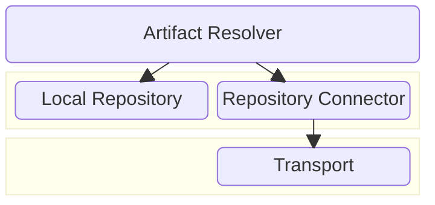
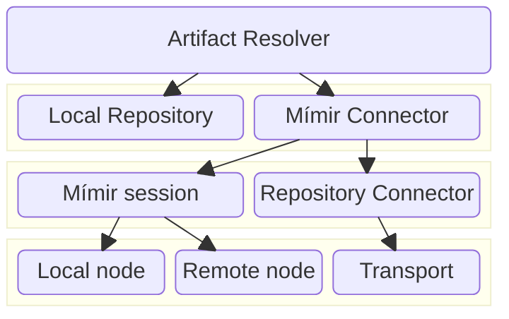

Yes, so let me repeat: "Do nuke your local repository" (regularly). Or to rephrase:
do not stick to your local repository (irrelevant are we talking about Maven 3 or Maven 4).

Maven local repository is "mish-mash" of things: is a cache, but also some "staging" area
as well, and it is very, very easy to get it corrupted. Simplest fix? Nuke it regularly.

Yes, things like split local repository may help, but you still need to exercise huge self-discipline.
Again; simplest is to regularly nuke it.

And despite Maven 4 is coming, it will not bring any (radical) improvement in this area, mostly due
backward compatibility with Maven 3 plugins and extensions.

But, there is some ray of light...

IMPORTANT: This below is _mainly for workstations_, later may be extended, but read it while you focus on 
your own workstation(s).

During holidays had some time to tinker, and one of topics were "what if we introduce a new
cache layer between Resolver Local Repository and Resolver Transport?". At least on workstation, we 
could have some single reliable cache, that should be reusable no matter how many or what kind of
Local Repositories user on workstation uses. Hopefully, this would make user nuke regularly his local repository, no?
It would be really enough for start, to handle release artifacts only (so no snapshots, nor metadata), as 
most often I hear as counter-argument that is time-consuming after nuking to rebuild things, 
that initial population of local repository takes long time (not with MRM, but more about that later).

Then later followup idea came: okay, so all workstations can have central piece of cache, but what if they _publish
and share cache contents across LAN_? I usually work on 3 computers (1 desktop and 2 laptops), and if I downloaded
one huge artifact once, I'd really like to have it shared across LAN, instead to re-download it again after I switched
workstation. But let's go in order.

The current layout of relevant Resolver bits, that are unchanged between Resolver 1.x and 2.x is following:



What happens (simplified), is that Artifact Resolver checks for Local Repository, and if searched thing not found,
will ask for Repository Connector to get it. Repository Connector handles all the "transport related bookkeeping",
so response from it will contain Artifacts that are _validated_ according to effective policies (ie. checksums),
and finally, the connector asks Transport to get the content from some remote repository.

For simplicity, I am showing only one (relevant) detail, as similar setup is in Metadata Resolver as well, but it is
irrelevant for current discussion.

### Meet Mímir

Mímir could sit between Artifact Resolver and Repository Connector, and provide a new layer of cache. For simplicity’s sake
currently it **handles only release artifacts originating from HTTP-ish remote repositories**.

Mímir has two types of "nodes": Local Node that is user-wide (workstation wide?) and always present, and may have 0 or more Remote Nodes.



What happens, is that Mímir can fetch artifacts from the local cache, moreover, if there are node publisher(s) on LAN,
will consult them as well.

### Mímir In Action

This idea is drafted here: https://github.com/maveniverse/mimir

Note: this is just Proof of Concept, and there is a lot of TODOs, like config and other things. But, it "works for me".

In short, current Mímir holds Local node under `~/.mimir/local` directory, and _hardlinks_ to effective local
repository the files (if possible, otherwise plain file copy happens). It also provides one Remote node implementation
using [JGroups 5.x](http://www.jgroups.org/) that will discover "Node publishers" on LAN. Right now, a Node publisher
publishes workstation Local node cache via LAN, and has to be manually started and kept alive. Protocol is trivial
and remains to be improved: consumer multicasts a lookup message, and nodes will report back with "OK" (hit) or 
"KO" (miss) messages. The hit messages also contain the IP address and port and a txID, where receiver can connect
to to download the file. Consumer will use his own Local node as "write through" cache and will finally offer it 
to Connector. This means that cache contents on single workstation are tried to keep in minimal copies (via hard-linking)
but they do replicate across workstations. Currently, the main intent was to keep dependencies minimum.

### Example session

On consumer side: This build uses Mímir extension, and starts with empty local repository (with a cheat: Mímir is 
present, as it is unreleased yet). The build finishes quickly, and without any remote transport, as Mímir served cached 
content via LAN (can be seen with `-X`):
https://asciinema.org/a/696900

On publisher side: Here, the workstation has pre-populated Mímir local cache. The publisher is started, that 
listens on LAN, and serves local cache content to remote. Assuming serving it via LAN is faster that letting LAN neighbor 
builder go remote: 
https://asciinema.org/a/696902

There are still rough edges, but for now I intentionally keep everything dead simple.

Update: Version 0.1.0 is released and is on Maven Central! To use it, either add to project in file `.mvn/extensions.xml`
or, if using Maven 4, you can make it user-wide extension by adding it to `~/.m2/extensions.xml`:

```xml
<?xml version="1.0" encoding="UTF-8"?>
<extensions>
    <extension>
        <groupId>eu.maveniverse.maven.mimir</groupId>
        <artifactId>extension3</artifactId>
        <version>0.1.0</version>
    </extension>
</extensions>
```

To publish your local cache on LAN, [download publisher from here](https://repo.maven.apache.org/maven2/eu/maveniverse/maven/mimir/node/jgroups/0.1.0/jgroups-0.1.0-cli.jar) and run it:

```
$ java -jar jgroups-0.1.0-cli.jar
```

To stop it, use Ctrl+C in console.